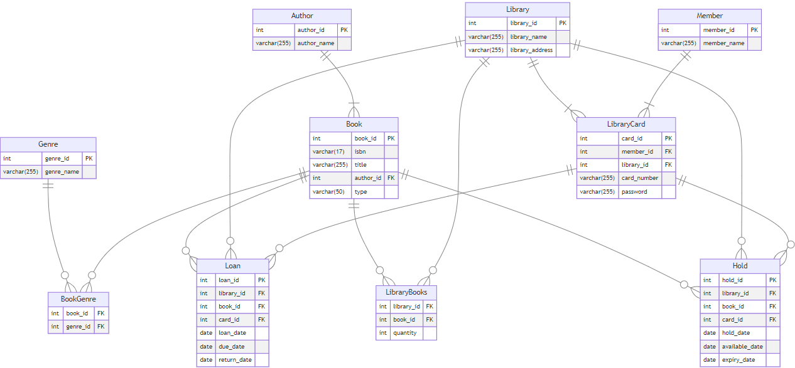

# E-Library Database System

This project involves creating an e-library database system that models various entities and their relationships. The system includes libraries, books, authors, genres, members, library cards, loans, and holds.

## Mission Statement

- Members can explore the titles available in the libraries.
- Members can search for books based on genre or type.
- Members can know how many copies the libraries have of a title.
- Members can borrow and place holds on books they want to read.
- Members can check the availability of books.

## Business Rules

Here are the requirements for the e-library database system:

1. **Manage Multiple Libraries:**
    - The system should handle data for multiple libraries, each with its own collection of books.
2. **Book Collection:**
    - Store information about books, including titles, authors, genres, and copies available for borrowing.
    - Books should be categorized for easier searching (e.g., self-help, biography, fantasy, romance, historical).
3. **Member Data:**
    - Store member information, allowing them to add their card(s) to the app.
    - Registered members should be able to borrow books, place holds, and manage their shelves.
4. **Loan and Hold System:**
    - Track borrowing transactions, including loan dates, due dates, and return dates.
    - Implement a loan period of 2 weeks, with automatic return of books after the due date.
    - Allow members to borrow up to 2 books at a time.
    - Enable members to place holds on books that are currently unavailable.
    - Maintain a hold queue and release held books if not borrowed within one week.
    - Members can hold up to 2 books at a time.

## ERD

## Database Making

The Data Definition Language (DDL) syntax for creating the database tables and their relationships can be found in the file [`DDL.sql`](DDL.sql).

## Making the Dummy Datasets

We use Python to generate dummy datasets for testing and development purposes. Libraries such as `Faker` and `Pandas` are used to create realistic and varied data. The script for generating these datasets can be found in the file [`generate_dummy.py`](generate_dummy.py).

## Inputting the Data

Since the data is randomly generated, it can be different each time. My dummy dataset can be found in the [`dummy_datasets`](dummy_datasets) folder. To input the data into SQL, you can use the syntax provided in [`input_data.sql`](input_data.sql). You will need to replace `/path/to/` with the actual path where your CSV files are stored.

## Objectives

1. [How many books are available in each library?](objectives/sql_query1.sql)
2. [Which genres are most popular across all libraries?](objectives/sql_query2.sql)
3. [How many books are currently on loan per library?](objectives/sql_query3.sql)
4. [Which books have the highest number of holds?](objectives/sql_query4.sql)
5. [What is the average loan duration for returned books?](objectives/sql_query5.sql)
